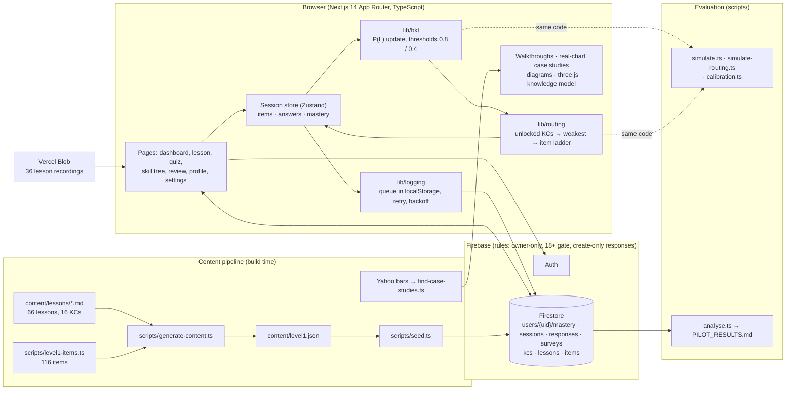

# TradeMind Academy

An Intelligent Tutoring System for trading education — BSc dissertation artefact
(Solent University, QHO634). **Educational simulation only:** no live market data,
no signals, no broker links, 18+.

The adaptive loop is the research core: auth → lesson → per-topic test →
Bayesian Knowledge Tracing mastery update → rule-based routing → dashboard,
with an append-only response log exported for evaluation.

Live: https://tmacademyuk.vercel.app

## How it fits together



The loop in one line: placement seeds the model → routing picks the weakest unlocked module and an item at the right difficulty → every answer updates P(L) and is logged with the estimate before and after → the dashboard, skill tree and knowledge model show the learner exactly what the model believes. The post-test and SUS survey close the study; `scripts/analyse.ts` turns the log into normalised gain, time on task and usability numbers.

## Running it

Read [START_HERE.md](START_HERE.md). It's one page: kill everything, run the real app,
run the practice app, open the database. [RUNNING.md](RUNNING.md) has the longer version.

## Stack

Next.js 14 (App Router, TS strict) · Tailwind (custom tokens) · Framer Motion ·
GSAP · react-three-fiber · lightweight-charts · Firebase (Auth/Firestore/Storage,
Emulator Suite locally) · React Query · Zustand · Vitest · Playwright.

## Development

```bash
npm install
npm run dev            # the app on :3000 (live project, real Google)
npm run dev:emulator   # a throwaway copy on :3100 against the local emulators
npm run emulators      # Firebase emulator suite (requires firebase-tools)
npm run test           # unit tests (Vitest)
npm run test:e2e       # E2E (Playwright; builds + serves automatically)
npm run lint && npm run typecheck
npm run simulate:routing   # adaptive vs fixed vs random routing, into docs/EVALUATION.md
npm run analyse            # pilot data (emulator) → docs/report/PILOT_RESULTS.md
npm run deploy             # production snapshot to Vercel (docs/DEPLOY.md)
```

Copy `.env.example` → `.env.local`. Local dev and tests target the emulator suite.

## Repository map

See `docs/BUILD_PROMPT.md` (canonical spec — re-read every session),
`docs/DECISIONS.md` (decision log), `design/prototype/` (Stitch screens,
reference only, never imported).
