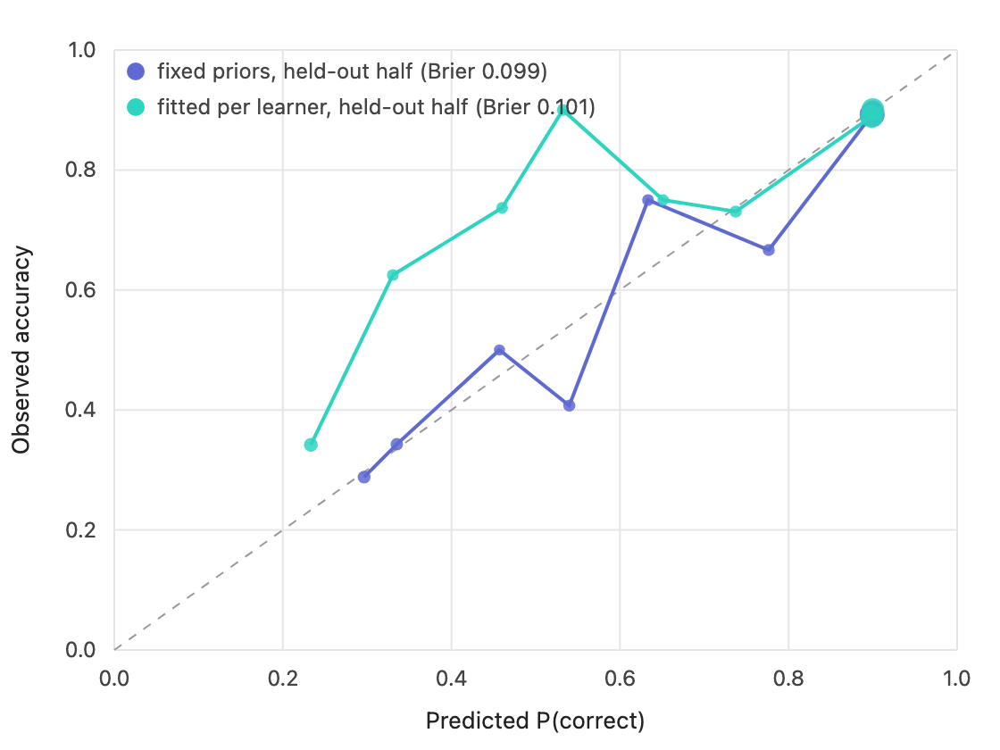

# BKT calibration report

Generated by `scripts/calibration.ts` on 2026-09-13.

## What this measures

Every logged answer carries the model's estimate that the learner knew the skill beforehand (pLBefore). Passed through the BKT emission model, P(correct) = pL(1 − slip) + (1 − pL)guess, that becomes a forecast. A calibrated model's forecasts come true at the rate they claim: answers given a 70% chance should be right about 70% of the time. The reliability table bins the forecasts into deciles and compares each bin's mean forecast with its observed accuracy. The Brier score is the mean squared error of the forecasts (0 is perfect, 0.25 is a coin toss); the baseline always forecasts the overall accuracy, and the skill score is the fraction of the baseline's error the model removes. Expected calibration error (ECE) is the count-weighted mean gap across the bins.

## Data

200 simulated learners × 40 opportunities, seed 42. Ground truth pL0 ~ U(0.05, 0.45), pT ~ U(0.05, 0.25); guess and slip fixed at the engine's values. The engine runs with its fixed priors (pL0 0.25, pT 0.12, pG 0.2, pS 0.1).

## Summary

| Model | Answers | Accuracy | Brier | Brier (baseline) | Skill | ECE |
| --- | ---: | ---: | ---: | ---: | ---: | ---: |
| Fixed priors, all answers | 8000 | 79.2% | 0.1220 | 0.1647 | 26.0% | 0.43 pp |
| Fixed priors, held-out second half | 4000 | 87.5% | 0.0994 | 0.1090 | 8.9% | 0.68 pp |
| Fitted per learner, held-out second half | 4000 | 87.5% | 0.1011 | 0.1090 | 7.3% | 1.17 pp |

## Reliability, fixed priors

| Predicted P(correct) | Answers | Mean predicted | Observed accuracy | Gap |
| --- | ---: | ---: | ---: | ---: |
| 0.2 to 0.3 | 550 | 29.7% | 29.8% | 0.2 pp |
| 0.3 to 0.4 | 609 | 34.5% | 34.5% | -0.0 pp |
| 0.4 to 0.5 | 14 | 46.5% | 64.3% | 17.8 pp |
| 0.5 to 0.6 | 281 | 54.7% | 54.1% | -0.6 pp |
| 0.6 to 0.7 | 146 | 64.5% | 69.2% | 4.6 pp |
| 0.7 to 0.8 | 183 | 78.1% | 76.0% | -2.1 pp |
| 0.8 to 0.9 | 4965 | 89.7% | 89.3% | -0.3 pp |
| 0.9 to 1.0 | 1252 | 90.0% | 89.9% | -0.1 pp |

## Reliability, fitted per learner (held-out half)

| Predicted P(correct) | Answers | Mean predicted | Observed accuracy | Gap |
| --- | ---: | ---: | ---: | ---: |
| 0.2 to 0.3 | 117 | 23.3% | 34.2% | 10.9 pp |
| 0.3 to 0.4 | 16 | 33.0% | 62.5% | 29.5 pp |
| 0.4 to 0.5 | 19 | 46.0% | 73.7% | 27.7 pp |
| 0.5 to 0.6 | 10 | 53.2% | 90.0% | 36.8 pp |
| 0.6 to 0.7 | 8 | 65.1% | 75.0% | 9.9 pp |
| 0.7 to 0.8 | 26 | 73.7% | 73.1% | -0.7 pp |
| 0.8 to 0.9 | 1932 | 89.9% | 88.9% | -1.0 pp |
| 0.9 to 1.0 | 1872 | 90.0% | 90.1% | 0.1 pp |

## Reading it

Fitting (pL0, pT) to each learner's first twenty answers raises the held-out Brier score by 0.0017 (1.7% of the fixed-prior error). The fixed priors hold up: with this little data per learner, fitting buys almost nothing, which is the case for keeping them until the pilot has run.

A limit to be honest about: the simulated learners share the engine's guess and slip values, so this run tests what happens when the priors on initial knowledge and learning rate are wrong (they are, by construction), not whether the emission model itself is right. That second question needs real answers, which is what the `--csv` path is for once the pilot has run.

The dotted line is perfect calibration. Points above it are bins where learners did better than the model expected; points below, worse. Dot size is the share of answers in the bin. ECE of 0.43 pp means the model's number is, on average, within about 1 percentage point of what actually happened.
